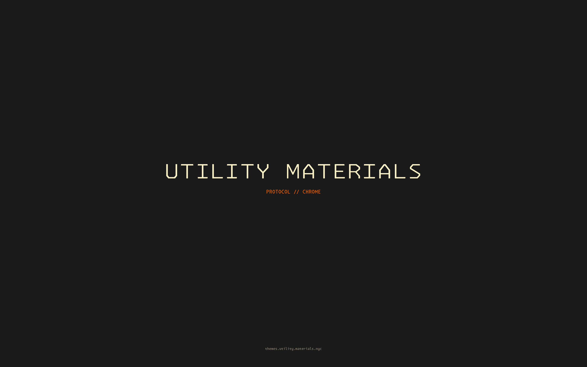

# Utility Materials Theme

A Chrome browser theme in the Utility Materials house style: charcoal frame, restrained orange as state, Monaspace Krypton wordmark on the New Tab page.



## Palette

| Role               | Hex       | RGB                |
| ------------------ | --------- | ------------------ |
| Frame (charcoal)   | `#1a1a1a` | `26, 26, 26`       |
| Toolbar (warm)     | `#2a1c12` | `42, 28, 18`       |
| Tab background     | `#1f1410` | `31, 20, 16`       |
| Foreground (cream) | `#fbf1c7` | `251, 241, 199`    |
| Secondary (steel)  | `#d5c4a1` | `213, 196, 161`    |
| State (orange)     | `#FF6700` | `255, 103, 0`      |
| Hover (bright)     | `#FF4500` | `255, 69, 0`       |

Type: Monaspace Krypton WideLight (rasterized into the New Tab background — Chrome themes can't load custom UI fonts).

## Install — Local (development)

The package ships as **two unpacked extensions** that pair together:

1. **The theme itself** — frame, toolbar, tabs, omnibox colors. Load `~/dev/umi-chrome-theme/`.
2. **The new tab override** (optional) — replaces `chrome://newtab` with the Utility Materials pipeline loop and an early-2000s skeuomorphic command center: analog clock face, weather, sunrise/sunset arc, calendar, live CPU/RAM telemetry, and network latency. All widgets are draggable; reload resets positions. Load `~/dev/umi-chrome-theme/ntp/`.

Either can be installed without the other. With only the theme, the new tab page shows the static "UTILITY MATERIALS" wordmark from `images/theme_ntp_background.png`. With both, the loop plays instead.

Steps:

1. Clone this repo.
2. Open `chrome://extensions`.
3. Toggle **Developer mode** in the top-right.
4. Click **Load unpacked** → select `~/dev/umi-chrome-theme/`.
5. Click **Load unpacked** again → select `~/dev/umi-chrome-theme/ntp/`.

### Iterating after edits

Chrome themes don't hot-reload. To see changes:

1. Open `chrome://settings/appearance` and click **Reset to default**.
2. Go back to `chrome://extensions` and click the **Reload** icon on the Utility Materials theme card.
3. Open a new tab to confirm the change.

`scripts/test-local.sh` prints these steps and tries to open `chrome://extensions` for you.

## Install — Chrome Web Store

Coming soon. Once the theme is approved, it will be listed at `themes.utility.materials.nyc` alongside the other Utility Materials themes (VS Code, Cursor, Obsidian, Codex, Blender).

## Files

```
manifest.json              # Chrome theme manifest (v3)
icon.png                   # 128x128 store-listing icon
images/
  theme_frame.png          # 5x80 charcoal tile
  theme_toolbar.png        # 5x40 warm-charcoal tile
  theme_tab_background.png # 5x40 tab tile
  theme_ntp_background.png # 2880x1800 wordmark on charcoal (fallback NTP)
ntp/                       # companion new tab extension (optional)
  manifest.json            # chrome_url_overrides.newtab
  newtab.html              # full-bleed video loop
  newtab.css               # #E75606 backdrop, object-fit: contain
  pipeline.mp4             # 1920x1440 H.264, ~5MB, 6.25s loop
  icon.png
scripts/
  test-local.sh            # local install helper
```

## Related

- [themes.utility.materials.nyc](https://themes.utility.materials.nyc) — index of all UMI themes
- [Utility Materials for VS Code](https://github.com/alexh/umi-vs-code-theme) — canonical palette reference

## License

GPL-2.0-or-later

## Credits

- **Weather icons**: [Icons8 Skeuomorphism set](https://icons8.com/icons/set/weather--style-skeuomorphism). Used in `ntp/icons/`.
- **Type**: [Monaspace](https://monaspace.githubnext.com) by GitHub Next. Krypton variant.
- **Brand wordmark**: original UMI mark.
